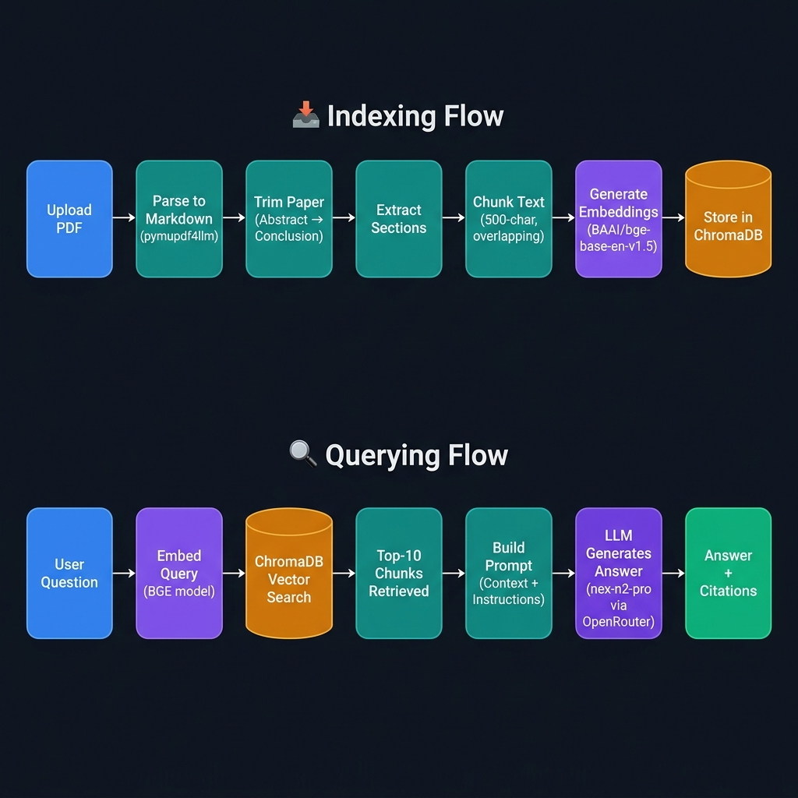

# 🔬 Research RAG Assistant

A robust, from-scratch Retrieval-Augmented Generation (RAG) system built specifically for academic researchers and students. This application allows users to upload PDF research papers and ask highly specific questions, receiving accurate, context-aware answers complete with direct citations to the source document's sections.

Instead of relying on high-level wrappers like LangChain or LlamaIndex, the entire RAG pipeline is built **from scratch** to provide maximum control over parsing, semantic chunking, and context retrieval.

---

## ✨ Features
- **Intelligent Academic Parsing:** Custom regex-based trimming removes boilerplate (like references and table of contents) and focuses strictly on the core content from Abstract/Introduction to Conclusion.
- **Context-Aware Semantic Chunking:** Text isn't just blindly split. Chunks are generated section-by-section, ensuring no chunk bleeds across different paper headings. 
- **Local Vector Database:** Uses ChromaDB for persistent, local storage of document embeddings.
- **Source-Cited Answers:** The UI dynamically parses chunk IDs to provide clean citation chips, showing exactly which paper and section the LLM used to generate its answer.
- **Premium User Interface:** A sleek, dark-themed Streamlit UI featuring animated chat bubbles, transparent indexing status, and pre-built suggestion chips.

---

## 🛠️ Tech Stack
- **Frontend UI:** [Streamlit](https://streamlit.io/)
- **PDF Parsing:** `pymupdf4llm` (Extracts structural markdown directly from PDFs)
- **Embeddings:** `sentence-transformers` utilizing the `BAAI/bge-base-en-v1.5` model for state-of-the-art semantic search.
- **Vector Storage:** `chromadb` (Persistent Local Client)
- **Large Language Model (LLM):** `nex-agi/nex-n2-pro:free` (via OpenRouter API)

---

## 📐 Architecture

The system has two main flows: **Indexing** (processing uploaded PDFs into searchable vectors) and **Querying** (answering user questions from those vectors).



### Deep Dive: The Custom RAG Pipeline
1. **Trimming (`paper_triming`):** Detects the start of the "Abstract" or "Introduction" and the start of "Conclusion" or "References". Everything outside these bounds is discarded to prevent the LLM from hallucinating on citations.
2. **Structuring (`getting_content_between_headers`):** Groups text strictly under its recognized Markdown heading.
3. **Chunking (`chunks_generation`):** Creates overlapping 500-character chunks that are injected with their parent heading, guaranteeing that every chunk retains its structural context.
4. **Retrieval (`query_builder`):** Fetches the top 10 most relevant chunks from ChromaDB and formats them into a strict prompt.
5. **Generation (`answer_generator`):** Sends the structured prompt to the OpenRouter API.

---
### Project Live 
[Research Assistance RAG System](https://rag-powered-research-assistance.streamlit.app/)

## 🚀 Getting Started

### 1. Prerequisites
Make sure you have Python 3.10+ installed.

### 2. Installation
Clone the repository and install the required dependencies:
```bash
pip install -r requirements.txt
```

### 3. Environment Variables
You need an OpenRouter API key for the LLM. 
Create a `.env` file in the root directory (or use Hugging Face Secrets if deploying there) and add:
```env
OPEN_ROUTER_API_KEY=your_openrouter_api_key_here
```

### 4. Run the Application
Launch the Streamlit server:
```bash
streamlit run app.py
```
Open the provided Local URL (usually `http://localhost:8501`) in your browser, drag and drop some research papers, index them, and start asking questions!
